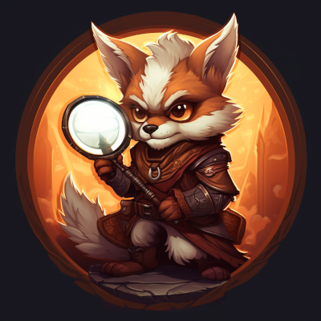

# lfgmon

## About

LFG Monitor (lfgmon) watches the group finder for rare role shortages and extra rewards (Satchel of Cooperation, aka blue bag). When it finds a shortage, it will display a helpful notification icon, and optionally can send you a chat & sound notification.

The addon tries to be non-intrusive with its default settings, and integrates well with the vanilla WoW UI.

## How does it work?

   * Install and enable the addon.
   * The tool will run in the background, and silently monitor eligible LFG dungeons and raids.

## When extra rewards are found:

   * a notification icon is displayed (see screenshots)
   * you can move the icon anywhere on the screen, it will remember the position
   * hover over the icon to see a list of dungeons and raids giving extra rewards
   * if notifications are enabled, you will also get a message and a sound notification for any new role shortages (see screenshots)

## Settings

You can open the settings window from the in-game Options menu, from the Addons tab by locating the "lfgmon" section (see screenshot).

You can also open the settings window using the `/lfgmon config` slash command.

You can enable/disable the following options:

   * Monitor Dungeons: when enabled, the tool will monitor the LFG - Random Dungeons. (default: enabled)
   * Monitor Raids: when enabled, the tool will monitor the LFR - Raid Finder. (default: enabled)
   * Consider Lockout: when enabled, you will not get notified about raid wings you have already killed all bosses in. (default: enabled)
   * Play Alert: to get chat/sound notifications, you will need to enable this option. (default: disabled)

## Commands

The following chat commands are available:

   * `/lfgmon config`: open the settings window
   * `/lfgmon reset`: reset all options, and the icon position to their default values. This can be useful if you accidentally moved the icon outside of the visible screen.

## Feedback, contribution

The addon is free and open source, governed by the GPLv3 license.

Please report bugs on the CurseForge page, preferably using the built-in issue tracker.

The source code is available here.